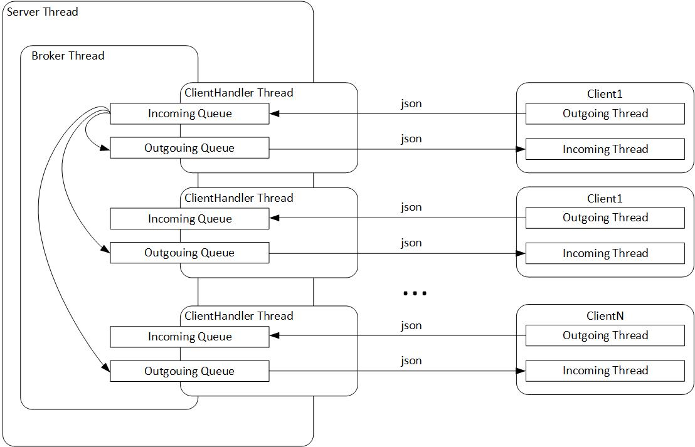

# Курсовой проект "Сетевой чат"

Реализация получилась несколько сложная, поскольку изначально по невнимательности условия задачи принял как более сложные. Переделывать не стал, так даже интереснее получилось.
Планировалось обмениваться с сервером служебной информацией, поэтому принята схема обмена сообщениями через json который потом преобразуется в класс Message. Клиент самый простой, все команды обрабатываются сервером, клиенту отправляется ответ с результатом. 

Схема реализации

Детали реализации:  
1. Отслеживается уникальность имения при подключении, если с таким именем уже подключились, предлагается зайти под другим именем.  
2. Клиент все команды отправляет на сервер, откуда получает ответ. При выходе, за счет этого мы корректно завершаем поток и удаляем очереди клиента из общего списка, уведомляем всех о выходе.  
3. Для отправки сообщения, необходимо нажать Enter, при этом прием сообщений останавливается, чтобы не мешать вводу (накапливаются в очереди).  
4. В файле конфигурации сервера присутствует параметр, максимальное количество потоков обработки, при превышении которого клиентам будет отказано в подключении с уведомлением, что сервер перегружен. При этом два потока из пула выделено, для обработки таких подключений.   

Из непонятного  
Как делать тесты для реализации Socket сервера и клиента
